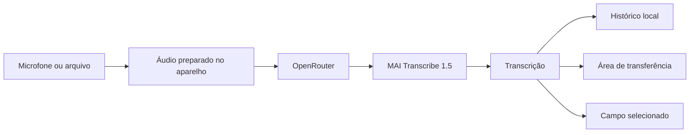

<div align="center">
  
  <h1>OpenFlow Mobile</h1>
  <p><strong>Write at the speed of thought.</strong></p>
  <p>Ditado rápido no Android, em qualquer aplicativo, com transcrição pela OpenRouter.</p>

  <p>
    <a href="https://github.com/MusicMaster4/OpenFlow-Mobile/releases/latest"></a>
    <a href="https://github.com/MusicMaster4/OpenFlow-Mobile/actions/workflows/ci.yml"></a>
    
    
  </p>

  <p>
    <a href="https://github.com/MusicMaster4/OpenFlow-Mobile/releases/latest/download/openflow.apk"><strong>Baixar versão stable</strong></a>
    ·
    <a href="https://github.com/MusicMaster4/OpenFlow-Mobile/releases/download/channel-testing/openflow-beta.apk"><strong>Baixar versão beta</strong></a>
  </p>
</div>

---

O OpenFlow transforma voz em texto sem interromper o que você está fazendo. Ative o círculo flutuante, fale e receba a transcrição no campo selecionado. O app também aceita arquivos de áudio, mantém um histórico local e mostra estatísticas de uso.

## O que torna o OpenFlow diferente

| | Recurso | Como ajuda |
|---|---|---|
| 🎙️ | **Gravação instantânea** | Um toque inicia; outro conclui e transcreve. |
| ◉ | **Círculo flutuante** | Grave sobre qualquer aplicativo sem trocar de tela. |
| ⌨️ | **Colagem automática opcional** | Entrega o texto diretamente no campo selecionado. |
| 📎 | **Importação de áudio** | Aceita WAV, MP3, M4A, AAC, FLAC, OGG e WebM. |
| 📚 | **Histórico local** | Pesquisa, copia e remove até 100 transcrições no aparelho. |
| 📊 | **Estatísticas** | Acompanha palavras, tempo de áudio e ritmo de uso. |
| 🔐 | **Chave protegida** | A chave da OpenRouter fica no Android Keystore. |
| ↻ | **Atualização no app** | Baixa, valida e instala o APK correto para o seu canal. |

## Da voz ao texto



O modelo inicial é `microsoft/mai-transcribe-1.5`. Nas configurações, você pode pesquisar e escolher qualquer modelo de transcrição disponível na OpenRouter; a escolha fica salva no aparelho. O áudio é enviado somente quando uma transcrição é solicitada. O histórico de texto e as preferências continuam no aparelho.

## Instalação

1. Baixe o APK **stable** ou **beta** nos links acima.
2. Abra o arquivo no Android e autorize a instalação quando solicitado.
3. No OpenFlow, adicione sua chave da [OpenRouter](https://openrouter.ai/keys).
4. Opcionalmente, ative o círculo flutuante e a colagem automática nas configurações.

> [!IMPORTANT]
> Escolha um canal e permaneça nele. O atualizador nunca oferece uma versão beta para uma instalação stable, nem uma stable para uma instalação beta.

## Dois canais, sem cruzamento

| Canal instalado | Branch | Versão | Release | Manifesto consultado |
|---|---|---|---|---|
| **stable** | `main` | `2.0.1` | Release normal, marcada como Latest | `releases/latest/.../android-update.json` |
| **beta** | `testing` | `2.0.1-testing.3` | Pre-release | `releases/download/channel-testing/.../android-update-beta.json` |

Cada APK recebe somente um endpoint no momento da compilação. Antes de baixar, o app ainda verifica o canal, o `versionCode`, a origem GitHub e o SHA-256 do arquivo. Essa dupla barreira impede que os canais se misturem mesmo se um manifesto for publicado incorretamente.

### Como as versões avançam

- O primeiro release de `main` é `v2.0.0`.
- O próximo push em `testing` produz `v2.0.1-testing.1`, depois `.2`, `.3` e assim por diante.
- O próximo push em `main` publica `v2.0.1` e reinicia a contagem da próxima beta.
- Um disparo manual do workflow pode escolher `patch`, `minor` ou `major`.
- Patch e minor carregam após `99`, seguindo o mesmo algoritmo usado pelo Duckweed.

## Atualizar sem perder configurações

Atualizações oficiais usam sempre:

- o mesmo `applicationId` (`com.jubar.voxora`);
- o mesmo keystore de release;
- a instalação por substituição do Android, sem desinstalar o pacote.

Com isso, `SharedPreferences`, histórico, estatísticas e dados do Android Keystore são preservados. **Não desinstale o app antes de atualizar**, pois a desinstalação remove os dados locais.

> [!NOTE]
> Um APK antigo assinado com chave de desenvolvimento não pode ser substituído por um release oficial assinado com outra chave. Essa migração inicial pode exigir uma reinstalação; depois dela, todos os releases oficiais preservam os dados normalmente.

## Privacidade e permissões

| Permissão | Motivo |
|---|---|
| Microfone | Gravar o áudio que será transcrito. |
| Exibir sobre outros apps | Mostrar o controle flutuante. |
| Acessibilidade, opcional | Colar a transcrição no campo selecionado. |
| Acesso à política de notificações, opcional | Silenciar interrupções durante a gravação. |
| Instalar pacotes | Entregar atualizações verificadas pelo próprio app. |

O serviço de acessibilidade é usado somente para inserir a transcrição solicitada. O OpenFlow não lê nem armazena o conteúdo da tela.

## Desenvolvimento local

### Requisitos

- Flutter `3.41.1` ou mais recente compatível com Dart `3.11`
- JDK `17`
- Android SDK
- Um aparelho ou emulador Android 7.0+ (API 24)

```bash
flutter pub get
dart format --output=none --set-exit-if-changed lib test
flutter analyze
flutter test
node --test scripts/*.test.mjs
flutter build apk --release
```

O APK fica em `build/app/outputs/flutter-apk/app-release.apk`.

### Estrutura principal

```text
lib/
├── src/controller/     estado e orquestração do app
├── src/screens/        tela principal e estatísticas
├── src/services/       gravação, OpenRouter, storage, overlay e updates
└── src/models/         histórico e métricas

android/app/src/main/
├── kotlin/             overlay, acessibilidade, áudio e instalador de updates
└── res/                ícones, sons e configuração Android

scripts/                versionamento e geração do manifesto
.github/workflows/      CI e releases stable/beta
```

## Configurar releases no GitHub

O workflow de release precisa de um único keystore permanente. Cadastre estes secrets em **Settings → Secrets and variables → Actions**:

| Secret | Conteúdo |
|---|---|
| `ANDROID_KEYSTORE_BASE64` | Arquivo PKCS12/JKS codificado em base64. |
| `ANDROID_KEYSTORE_PASSWORD` | Senha do keystore. |
| `ANDROID_KEY_ALIAS` | Alias da chave. |
| `ANDROID_KEY_PASSWORD` | Senha da chave. |

Exemplo para criar a chave uma única vez:

```bash
keytool -genkeypair -v \
  -keystore openflow-release.p12 \
  -storetype PKCS12 \
  -alias openflow \
  -keyalg RSA -keysize 4096 -validity 10000
```

Guarde o arquivo e as senhas fora do repositório. Perder ou trocar essa chave impede atualizações sobre instalações existentes.

## Publicação automática

- Push em `main`: testa, cria a próxima versão stable, assina `openflow.apk`, gera o manifesto e publica um release normal.
- Push em `testing`: testa, cria a próxima beta, assina `openflow-beta.apk`, publica uma pre-release e atualiza o ponteiro permanente `channel-testing`.
- Pull requests e branches de feature: executam apenas formatação, análise e testes.
- Alterações somente em documentação não disparam um release.

---

<div align="center">
  <sub>OpenFlow Mobile · voz entrando, texto fluindo.</sub>
</div>
