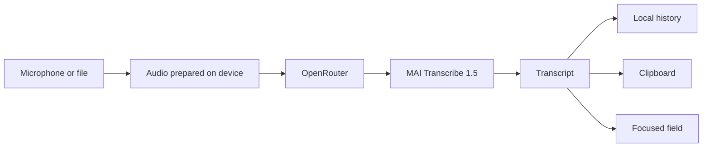

<div align="center">
  
  <h1>OpenFlow Mobile</h1>
  <p><strong>Write at the speed of thought.</strong></p>
  <p>Fast dictation on Android, in any app, with OpenRouter transcription.</p>

  <p>
    <a href="https://github.com/MusicMaster4/OpenFlow-Mobile/releases/latest"></a>
    <a href="https://github.com/MusicMaster4/OpenFlow-Mobile/actions/workflows/ci.yml"></a>
    
    
  </p>

  <p>
    <a href="https://github.com/MusicMaster4/OpenFlow-Mobile/releases/latest/download/openflow.apk"><strong>Download stable</strong></a>
    ·
    <a href="https://github.com/MusicMaster4/OpenFlow-Mobile/releases/download/channel-testing/openflow-beta.apk"><strong>Download beta</strong></a>
  </p>
</div>

---

OpenFlow turns speech into text without interrupting what you are doing. Turn on the floating circle, speak, and the transcript lands in the focused field. The app also accepts audio files, keeps a local history, and shows usage stats.

## What makes OpenFlow different

| | Feature | What it does |
|---|---|---|
| 🎙️ | **Instant recording** | One tap starts; another finishes and transcribes. |
| ◉ | **Floating circle** | Record over any app without switching screens. |
| ⌨️ | **Optional auto-paste** | Inserts the text directly into the focused field. |
| 📎 | **Audio import** | Accepts WAV, MP3, M4A, AAC, FLAC, OGG, and WebM. |
| 📚 | **Local history** | Search, copy, and delete up to 100 transcripts on the device. |
| 📊 | **Stats** | Tracks words, audio time, and usage pace. |
| 🔐 | **Protected key** | The OpenRouter key stays in the Android Keystore. |
| ↻ | **In-app updates** | Downloads, verifies, and installs the APK for your channel. |

## From voice to text



The default model is `microsoft/mai-transcribe-1.5`. In settings you can search and pick any transcription model available on OpenRouter; the choice is stored on the device. Audio is sent only when a transcription is requested. Transcript history and preferences stay on the device.

## Installation

1. Download the **stable** or **beta** APK from the links above.
2. Open the file on Android and allow installation when prompted.
3. In OpenFlow, add your [OpenRouter](https://openrouter.ai/keys) key.
4. Optionally, turn on the floating circle and auto-paste in settings.

> [!IMPORTANT]
> Pick a channel and stay on it. The updater never offers a beta build to a stable install, or a stable build to a beta install.

## Two channels, no crossover

| Installed channel | Branch | Version | Release | Manifest used |
|---|---|---|---|---|
| **stable** | `main` | `2.0.1` | Regular release, marked as Latest | `releases/latest/.../android-update.json` |
| **beta** | `testing` | `2.0.1-testing.3` | Pre-release | `releases/download/channel-testing/.../android-update-beta.json` |

Each APK is compiled with a single update endpoint. Before downloading, the app still checks the channel, `versionCode`, GitHub origin, and the file SHA-256. That second check keeps the channels from mixing even if a manifest is published incorrectly.

### How versions advance

- The first `main` release is `v2.0.0`.
- The next push to `testing` produces `v2.0.1-testing.1`, then `.2`, `.3`, and so on.
- The next push to `main` publishes `v2.0.1` and resets the next beta count.
- A manual workflow run can choose `patch`, `minor`, or `major`.
- Patch and minor carry over after `99`, using the same algorithm as Duckweed.

## Update without losing settings

Official updates always use:

- the same `applicationId` (`com.jubar.voxora`);
- the same release keystore;
- Android's in-place install, without uninstalling the package.

That keeps `SharedPreferences`, history, stats, and Android Keystore data. **Do not uninstall the app before updating.** Uninstalling wipes local data.

> [!NOTE]
> An older APK signed with a development key cannot be replaced by an official release signed with a different key. That first migration may require a reinstall. After that, official releases keep data as usual.

## Privacy and permissions

| Permission | Why |
|---|---|
| Microphone | Record the audio to transcribe. |
| Display over other apps | Show the floating control. |
| Accessibility, optional | Paste the transcript into the focused field. |
| Notification policy access, optional | Mute interruptions while recording. |
| Install packages | Deliver updates verified by the app itself. |

The accessibility service is used only to insert the requested transcript. OpenFlow does not read or store screen contents.

## Local development

### Requirements

- Flutter `3.41.1` or a later version compatible with Dart `3.11`
- JDK `17`
- Android SDK
- An Android 7.0+ device or emulator (API 24)

```bash
flutter pub get
dart format --output=none --set-exit-if-changed lib test
flutter analyze
flutter test
node --test scripts/*.test.mjs
flutter build apk --release
```

The APK is written to `build/app/outputs/flutter-apk/app-release.apk`.

### Main layout

```text
lib/
├── src/controller/     app state and orchestration
├── src/screens/        home screen and stats
├── src/services/       recording, OpenRouter, storage, overlay, and updates
└── src/models/         history and metrics

android/app/src/main/
├── kotlin/             overlay, accessibility, audio, and update installer
└── res/                icons, sounds, and Android config

scripts/                versioning and manifest generation
.github/workflows/      CI and stable/beta releases
```

## Set up GitHub releases

The release workflow needs a single permanent keystore. Add these secrets under **Settings → Secrets and variables → Actions**:

| Secret | Contents |
|---|---|
| `ANDROID_KEYSTORE_BASE64` | PKCS12/JKS file encoded as base64. |
| `ANDROID_KEYSTORE_PASSWORD` | Keystore password. |
| `ANDROID_KEY_ALIAS` | Key alias. |
| `ANDROID_KEY_PASSWORD` | Key password. |

Example of creating the key once:

```bash
keytool -genkeypair -v \
  -keystore openflow-release.p12 \
  -storetype PKCS12 \
  -alias openflow \
  -keyalg RSA -keysize 4096 -validity 10000
```

Keep the file and passwords out of the repository. Losing or replacing this key blocks updates over existing installs.

## Automatic publishing

- Push to `main`: tests, creates the next stable version, signs `openflow.apk`, writes the manifest, and publishes a regular release.
- Push to `testing`: tests, creates the next beta, signs `openflow-beta.apk`, publishes a pre-release, and updates the permanent `channel-testing` pointer.
- Pull requests and feature branches: format, analyze, and test only.
- Documentation-only changes do not trigger a release.

---

<div align="center">
  <sub>OpenFlow Mobile · voice in, text out.</sub>
</div>
